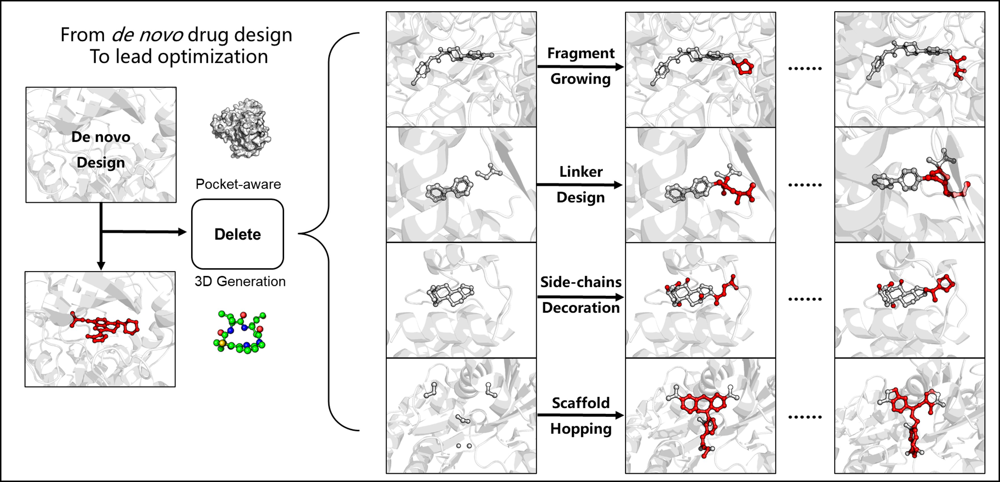
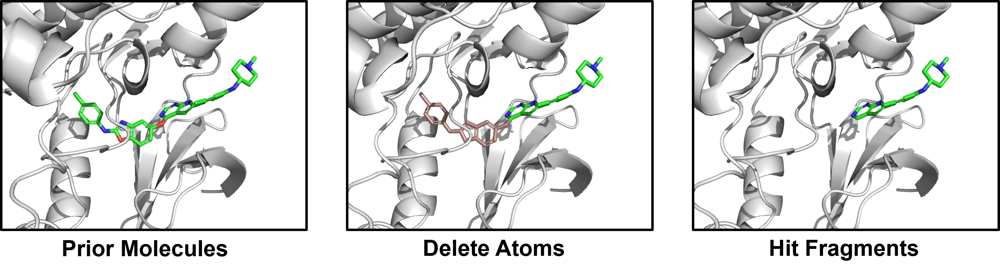
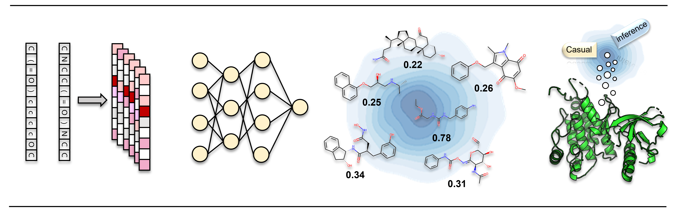

# 🌈**Structure-based Deep Molecular Generation Paradigm Enables Efficient Design of Potent CLIP1-LTK Inhibitors**


<div align=center>

</div>
## Environment

### First Approach

Install via conda .yml file (cuda 11.3)

```Shell
conda install mamba
mamba env create -f delete_environment.yml -n delete
conda activate delete
```

Of note, the mamba could be replaced by conda.

### Second Approach 

We also offer a Conda package for easy installation, which is available for download from [Zenodo](https://doi.org/10.5281/zenodo.7980554). After downloading, simply unzip the package in your conda environments directory. In my case, the directory is located at `~/.conda/envs`. We extend our sincere gratitude to the team at Zenodo, who provide a valuable free platform for storing large files for scholarly purposes.

```shell
mkdir ~/.conda/envs/surfgen
tar -xzvf delete.tar.gz -C ~/.conda/envs/delete
conda activate delete
```

Please remember to replace "my case" with your actual username or replace it depending on your requirements.

### Docking Environment 

```python
conda create -n docking rdkit ipykernel jupyter biopython python=3.8 easydict -c rdkit -c conda-forge
# Then download mgltools locally, do not use the conda! 
```


## Delete Prior Molecules 

I have provided an example to suggest new structures using adbr1 example, use this command to generate 3D molecules given the protein and lead fragment! The pretrained checkpoint could be downloaded [here](https://doi.org/10.5281/zenodo.7985201).

```python
python -u design_mols.py --surf_path ./example/adrb1/adrb_pocket_8.0.ply --frag_path ./example/adrb1/2VT4_frag.sdf --check_point ./checkpoint/ckpt/delete.pt --outdir ./outputs --suboutdir adrb1
# main parameters: 
# --surf_path: the provided surface file
# --frag_path: the lead waiting for optimization
```

Here, I provide a famous drug-design example, the inhibitor for adrb1, which can be used in the treatment of hypertension. The crystal structure of bounded cyanopindolol was selected as the reference ligand. Then we delete its heteroaromatic moiety, retaining solely the ethanolamine backbone as the foundation for Delete generation.

<div align=center>

</div>


## Combining Structure-based and Ligand-based Paradigms 

<div align=center>

</div>
#### Private data preparation

Prepare your own data in the ./causal_inference/SDF, with each .sdf file being a molecule of interest. 

#### Label preparation (Optional)

Then get the label of each molecule. For example, predicted affinity, IC50/Kd, or the docking score. 

```shell
# If you do not have the affinity label, docking is an alternative choice. 
python ./causal_inference/docking.py 
```

Then, each *.sdf file will be processed as the *_out.sdf file. 

#### LMDB data preparation 

Follow the guidance in the `./causal_inference_data.ipynb`

Firstly, create the protein-ligand index files. Secondly, create the LMDB database with the index.pkl Thirdly, transform each data in the LMDB database to filter the invalid train sample, leaving them out of the name2id dictionary. For the train_val_split, the first twenty samples are treated as validation sets. 

If you run them successfully, you will get the `causal_inference_data.lmdb`, `causal_inference_data.lmdb-lock`, `causal_inference_data_name2id.pt`, `causal_inference_data_split_name.pt` in the `./data`

#### Transfer the chemical space to the structure-based model

```shell
# Of note, change the base model in the config file, and make sure the data path is correct. 
python causual_inference_transfer.py --config ./causual_inference.yml
```


## Data

The base data for training can be found at [CrossDock](https://doi.org/10.5281/zenodo.7980002), including `lmdb`, `lmdb-lock`, `name2id`, `split_by_name`. 

## Train Base model 

```shell
python delete_train.py --config ./configs/base_train.yml
```


## Optional Make surface data on your own

### create the base Python environment

#### Approach 1

Despite the fact that we've already prepared the necessary data for training and evaluation, you might want to utilize SurfGen for your specific use case. To facilitate this, we've outlined guidelines to assist in creating your own 'surf_maker' environment.

```shell
conda create -n surface pymesh2 jupyter scipy joblib biopython rdkit plyfile -c conda-forge
```

#### Approach 2 

```shell
conda env create -f surf_maker_environment.yml
```

#### Install APBS Toolkits

When the base python environment was created, then install [APBS-3.0.0](https://github.com/Electrostatics/apbs/releases), [pdb2pqr-2.1.1](https://github.com/Electrostatics/apbs-pdb2pqr/releases) on your computer. Then set the msms_bin, apbs_bin, pdb2pqr_bin, and multivalue_bin path directly in your  `./bashrc`  or just set them in the scripts when creating the surface file from the pdb file.  (Like `./utils/masif/generate_prot_ply.py` )

​    

#### Try Generate Surface Now !

Having successfully set up all the necessary environments, you can now proceed to generate surface data. Please follow the instructions in `./data/surf_maker` for this process. Alternatively, to test the successful configuration of your environment, you can execute the `./data/surf_maker/surf_maker_test.py` script.

```shell
python ./data/surf_maker/surf_maker_test.py
```

If the surface is generated, you will find the .ply file in the ./data/surf_maker
